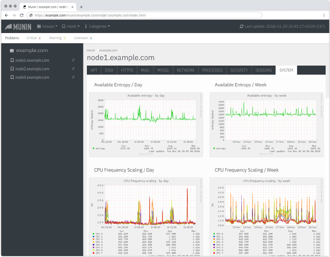

# mui
a responsive Munin 2.x UI template based on [Bootstrap 4](http://getbootstrap.com/).

### Installation

- backup the ``templates`` and ``static`` directories in your [Munin](http://munin-monitoring.org/) installation. (~ ``/etc/munin``)
- replace them with ``templates`` and ``static`` from this repo (``/munin/..``).
- wait for the next munin-cron cycle.
- browse to your Munin frontend and expect to see something like this:

### Credits

- Munstrap
https://github.com/jonnymccullagh/munstrap/

- Bootstrap 4.x
http://getbootstrap.com/

- Munin
http://munin-monitoring.org/

### Disclaimer
- This is work in progress
- I myself only monitor a handful of machines so let me know how this template works on larger installations.
